# GridCast ⚡

**An end-to-end MLOps platform for short-term electricity grid demand forecasting.**

GridCast ingests hourly load data from U.S. grid operators, warehouses and
transforms it, trains a gradient-boosted demand forecaster, serves predictions
through an API, and surfaces them in an interactive operator-style dashboard —
with the full MLOps loop (experiment tracking, drift detection, and
trigger-on-drift retraining) orchestrated on top.

It is built as a portfolio piece demonstrating a complete **data-engineering +
MLOps** workflow: ingestion → object storage → warehouse → transformation →
feature engineering → model → serving → monitoring → orchestration → CI/CD.

---

## Table of contents

- [What it does](#what-it-does)
- [Why this project](#why-this-project)
- [Architecture](#architecture)
- [Tech stack](#tech-stack)
- [Data source](#data-source)
- [The forecasting model](#the-forecasting-model)
- [MLOps loop](#mlops-loop)
- [Repository structure](#repository-structure)
- [Prerequisites](#prerequisites)
- [Quickstart](#quickstart)
- [Configuration](#configuration)
- [Pipeline stages in detail](#pipeline-stages-in-detail)
- [Build status / roadmap](#build-status--roadmap)
- [Design decisions](#design-decisions)
- [Limitations](#limitations)
- [Skills demonstrated](#skills-demonstrated)
- [License](#license)

---

## What it does

A user picks a **grid region** (PJM, CISO, or ERCOT) and the dashboard shows:

- **Latest reported load (MW)** — the most recent hourly demand reading.
- **Grid-stress risk score (0–100)** — a derived indicator of how close the
  region is running to historically stressful demand levels.
- **Next-24h demand forecast curve** — the model's hourly prediction, with the
  forecast **peak** highlighted and a **confidence band** around the curve.
- **An MLOps status strip** — current model version, drift status, and the
  timestamp of the last retrain — so the operational health of the system is
  visible alongside the prediction.

Two surfaces are exposed (both shown in the demo):

| Surface | URL | Role |
| --- | --- | --- |
| **Streamlit dashboard** | `http://localhost:8501` | The user-facing UI |
| **FastAPI service** | `http://localhost:8000/docs` | The prediction engine + OpenAPI docs |

---

## Why this project

Short-term load forecasting is a real, consequential problem: grid operators use
it to schedule generation and avoid both blackouts and wasteful over-provisioning.
It also happens to be an ideal backbone for showing off a *full* data platform,
because it touches every layer — high-volume time-series ingestion, warehousing,
feature engineering, ML, real-time-ish serving, and continuous monitoring.

The goal is a system that runs **end-to-end** and is **explainable layer by
layer**, with particular care given to the data-engineering core (dbt, Snowflake,
warehousing, Airflow) that ties everything together.

---

## Architecture

```mermaid
flowchart LR
    EIA["EIA API v2<br/>hourly D + DF"] -->|paginated pull| ING["Ingestion<br/>(Python)"]
    ING -->|raw NDJSON,<br/>partitioned| S3["AWS S3<br/>raw layer"]
    S3 -->|external stage<br/>COPY INTO| SF[("Snowflake<br/>raw schema")]
    SF --> DBT["dbt<br/>staging → intermediate → marts"]
    DBT -->|feature tables<br/>lags / rolling / calendar| FEAT[("Feature marts")]
    FEAT --> TRAIN["LightGBM training<br/>+ MLflow tracking"]
    TRAIN -->|registered model| REG[("MLflow<br/>model registry")]
    REG --> API["FastAPI<br/>/predict /health"]
    API --> UI["Streamlit<br/>dashboard"]
    FEAT --> DRIFT["Evidently<br/>drift report"]
    DRIFT -->|threshold breach| RETRAIN["Retrain DAG<br/>(triggerable)"]
    RETRAIN --> TRAIN

    subgraph ORCH["Airflow (LocalExecutor)"]
        DAG1["ingest → stage → dbt DAG"]
        DAG2["trigger-on-drift retrain DAG"]
    end
    ORCH -.orchestrates.-> ING
    ORCH -.orchestrates.-> DBT
    ORCH -.orchestrates.-> RETRAIN
```



**Data flows in one direction**: external API → immutable object storage →
warehouse → transformed feature marts → model → serving → UI, with monitoring
reading from the feature marts and able to loop back into retraining. Everything
is containerized with Docker Compose and gated by a GitHub Actions CI pipeline.

---

## Tech stack

| Layer | Technology | Role in GridCast |
| --- | --- | --- |
| **Data source** | EIA Open Data API v2 | Hourly demand (`D`) and EIA's own day-ahead forecast (`DF`, used as a baseline) |
| **Ingestion** | Python (`requests`, `boto3`) | Paginated pull, retry/backoff, immutable raw landing |
| **Object storage** | AWS S3 | Raw, partitioned, immutable NDJSON landing zone |
| **Warehouse** | Snowflake (XS warehouse) | Central analytical store; raw + transformed schemas |
| **Transformation** | dbt | `staging → intermediate → marts` modeling; feature engineering in SQL |
| **Feature store** | dbt feature marts (Snowflake tables) | Point-in-time-correct lag / rolling / calendar features |
| **Modeling** | LightGBM | Gradient-boosted hourly demand forecaster |
| **Experiment tracking** | MLflow | Run/metric/param logging, model registry, versioning |
| **Serving** | FastAPI | `/predict` (24h curve + peak + band + stress score), `/health`, `/docs` |
| **UI** | Streamlit | Region picker, load gauge, forecast chart, MLOps strip |
| **Monitoring** | Evidently | Data/prediction drift reports and thresholds |
| **Orchestration** | Apache Airflow (`LocalExecutor`) | Ingest→stage→dbt DAG + triggerable retrain DAG |
| **Packaging** | Docker + Docker Compose | Reproducible multi-service local deployment |
| **CI/CD** | GitHub Actions | Lint, `dbt parse`, API tests on every push |

---

## Data source

All data comes from the [EIA Open Data API v2](https://www.eia.gov/opendata/),
which is **free** — register at
[eia.gov/opendata/register.php](https://www.eia.gov/opendata/register.php) and a
key is emailed instantly.

- **Endpoint:** `https://api.eia.gov/v2/electricity/rto/region-data/data/`
- **Frequency:** `hourly` (UTC)
- **Regions (`respondent` facet):** `PJM`, `CISO`, `ERCO` (ERCOT)
- **Series (`type` facet):**
  - `D` — actual demand (the modeling target)
  - `DF` — EIA's day-ahead demand forecast (the **benchmark** the model is
    measured against)
- **Units:** megawatthours
- **History:** the current dataset runs 2019→present, giving years of hourly
  history per region — enough to train immediately with no cold-start.
- **Pagination:** `offset` + `length` (max 5000 rows/request); the ingestion
  loop reads `response.total` and advances until the window is fully covered.
- **Freshness caveat:** EIA bulk-updates roughly twice daily, so the dashboard's
  "current load" is really the **latest reported hour** and can lag wall-clock
  time by several hours. It is labeled as such in the UI.

> A small browser-pasteable request (with `length=5`) against the endpoint is the
> fastest way to confirm your key and the facet codes before running a full backfill.

---

## The forecasting model

- **Target:** next-24h hourly demand (MW) per region.
- **Model:** LightGBM regressor.
- **Features (engineered in dbt, not in Python):**
  - **Lag features** — demand at *t−1h*, *t−24h*, *t−168h* (prior hour, prior
    day, prior week).
  - **Rolling features** — rolling mean / standard deviation over recent windows.
  - **Calendar features** — hour-of-day, day-of-week, month, weekend/holiday flags.
  - **Baseline join** — actual demand (`D`) joined to EIA's forecast (`DF`).
- **Train/test split:** strictly **time-based** (never shuffled) so no future
  information leaks into training — the cardinal rule for time-series.
- **Evaluation:** MAE / MAPE on a held-out future window, **benchmarked against
  EIA's own `DF` forecast**. "Beats (or matches) the operator's published
  forecast" is a far more credible claim than an abstract error number.

---

## MLOps loop

- **Tracking:** every training run logs params, metrics (MAE/MAPE vs baseline),
  and the model artifact to **MLflow**, with model versions in the registry.
- **Drift detection:** **Evidently** compares the current feature/prediction
  distribution against a reference window and emits a drift report; a threshold
  breach is the signal to retrain.
- **Retraining:** a dedicated **Airflow DAG** is triggerable on drift — it
  re-runs feature refresh + training and registers a new model version. The demo
  exercises this deliberately by feeding in a distribution-shifted slice (e.g. a
  heatwave week) so drift fires on camera and the retrain runs live.

---

## Repository structure

```
gridcast/
├── README.md
├── docker-compose.yml          # all services: airflow, mlflow, api, dashboard
├── .env.example                # required environment variables
├── .github/
│   └── workflows/
│       └── ci.yml              # lint + dbt parse + API tests
├── src/ingestion/
│   ├── data_ingestion.py       # config loader (config/data_ingestion.config)
│   ├── ingest_eia.py           # EIA client: pagination, retry, NDJSON + manifest writer
│   └── run.py                  # CLI: backfill driver (make ingest-dry / make ingest)
├── snowflake/
│   └── setup.sql               # warehouse, db, schemas, file format, external stage
├── dbt/
│   └── gridcast/
│       ├── dbt_project.yml
│       ├── models/
│       │   ├── staging/        # 1:1 cleaned views over raw sources
│       │   ├── intermediate/   # joins, reshaping
│       │   └── marts/          # feature tables ("feature store")
│       └── sources.yml
├── ml/
│   ├── train.py                # LightGBM + MLflow, time-based split
│   └── requirements.txt
├── api/
│   ├── main.py                 # FastAPI prediction service
│   └── requirements.txt
├── dashboard/
│   └── app.py                  # Streamlit UI
├── monitoring/
│   └── drift.py                # Evidently drift report + threshold
├── airflow/
│   └── dags/
│       ├── ingest_stage_transform_dag.py
│       └── retrain_dag.py
└── docs/
    └── images/                 # screenshots / architecture diagram
```

---

## Prerequisites

- **Docker** and **Docker Compose**
- **Python 3.11+** (for running scripts outside containers)
- A free **EIA API key**
- An **AWS account** (S3 free tier is sufficient)
- A **Snowflake account** (the 30-day free trial covers the whole build)

---

## Quickstart

```bash
# 1. Clone and configure
git clone https://github.com/<you>/gridcast.git
cd gridcast
cp .env.example .env          # fill in EIA_API_KEY, S3 bucket, Snowflake creds

# 2. Land data (inspect locally first, no AWS needed)
pip install -e . -r requirements/base.txt
python -m src.ingestion.run --dry-run          # writes NDJSON + manifests under ./data/

# 2b. Real backfill to S3 (~5 years, all regions/types, per config/data_ingestion.config)
python -m src.ingestion.run

# 3. Warehouse setup + transformations
#    run snowflake/setup.sql, then:
cd dbt/gridcast && dbt deps && dbt build

# 4. Train the model
python ml/train.py

# 5. Bring up the full stack
docker compose up --build
#    → dashboard at http://localhost:8501
#    → API docs  at http://localhost:8000/docs
```

---

## Configuration

All secrets and connection settings come from environment variables (see
`.env.example`):

| Variable | Purpose |
| --- | --- |
| `EIA_API_KEY` | EIA Open Data API key |
| `GRIDCAST_S3_BUCKET` | Target bucket for raw landing |
| `AWS_*` | AWS credentials (prefer the standard `aws configure` chain) |
| `SNOWFLAKE_ACCOUNT` / `_USER` / `_PASSWORD` / `_ROLE` / `_WAREHOUSE` / `_DATABASE` | Warehouse connection |
| `MLFLOW_TRACKING_URI` | MLflow server location |

Credentials are **never** committed; `.env` is gitignored and `.env.example`
documents the contract.

---

## Pipeline stages in detail

1. **Ingest** — `ingest_eia.py` paginates `D` and `DF` for each region and writes
   immutable NDJSON to S3, Hive-partitioned as
   `region=<R>/type=<T>/ingest_date=<date>/`, plus a run **manifest** (row
   counts, empty-partition flags, API version) for lineage.
2. **Stage** — an S3 **external stage** + `COPY INTO` loads the raw NDJSON into a
   Snowflake `VARIANT` raw table; partition columns are derived from the file path.
3. **Transform (dbt)** — `staging` models clean and type the raw records;
   `intermediate` models join `D`↔`DF` and reshape; `marts` materialize the
   feature tables (lags, rolling stats, calendar) used for both training and serving.
4. **Train** — `train.py` pulls the feature marts, does a **time-based split**,
   fits LightGBM, evaluates against the `DF` baseline, and logs everything to MLflow.
5. **Serve** — FastAPI loads the registered model and exposes `/predict`
   (24h curve, peak, confidence band, stress score) and `/health`.
6. **Visualize** — Streamlit calls the API and renders the region dashboard +
   MLOps strip.
7. **Monitor** — Evidently builds a drift report from recent vs reference data.
8. **Orchestrate** — Airflow runs the ingest→stage→dbt DAG and a separate
   trigger-on-drift retrain DAG.

---

## Build status / roadmap

This is built over ~10 days; the table reflects the intended sequence. The
critical demo path (ingest → train → API → UI) is prioritized so a recordable
demo exists even before orchestration is wrapped on top.

| Day | Milestone | Status |
| --- | --- | --- |
| 1 | EIA ingestion → S3 raw landing | ✅ |
| 2 | S3 external stage → Snowflake; dbt staging | ⬜ |
| 3 | dbt feature marts (lags / rolling / calendar) | ⬜ |
| 4 | LightGBM training + MLflow + baseline benchmark | ⬜ |
| 5 | FastAPI prediction service | ⬜ |
| 6 | Streamlit dashboard *(demo-able milestone)* | ⬜ |
| 7 | Evidently drift + engineered drift slice | ⬜ |
| 8 | Airflow DAGs (ingest/stage/dbt + retrain) | ⬜ |
| 9 | Docker Compose integration + GitHub Actions CI | ⬜ |
| 10 | End-to-end dry run + record demo | ⬜ |

---

## Design decisions

- **Time-based split, never shuffled** — prevents leakage of future demand into
  training; the only correct choice for forecasting.
- **Benchmark against EIA's `DF`** — measures the model against the grid
  operator's own published forecast, not an arbitrary baseline.
- **dbt marts *are* the feature store** — point-in-time-correct feature tables in
  Snowflake, rather than a separate feature-store service. Simpler, fully
  explainable, and standard practice for a project this size.
- **Immutable raw layer** — ingestion never transforms field values; all logic
  lives in dbt, keeping a clean, auditable `raw → staging → mart` lineage.
- **Snowflake XS + 60s auto-suspend** — keeps the 30-day trial well within free
  credits for a system that runs on demand.
- **Streamlit over a JS framework** — fastest path to a credible UI for a solo
  build; the engineering story is in the pipeline, not the frontend.
- **Slim Airflow (`LocalExecutor`)** — drops Redis/Celery workers; lighter on a
  laptop while still demonstrating real DAG orchestration.

---

## Limitations

- **Not real-time.** Data is as fresh as EIA's ~twice-daily update; "current
  load" is the latest *reported* hour.
- **Runs-once demo posture.** Infrastructure is tuned for a single clean
  end-to-end run and a recorded demo, not 24/7 production SLAs.
- **Three regions.** PJM/CISO/ERCO are a representative slice, not the full set
  of U.S. balancing authorities; adding more is a config change.
- **Confidence band is an estimate.** It communicates uncertainty for the demo;
  it is not a calibrated prediction interval.

---

## Skills demonstrated

**Data engineering:** API ingestion with pagination/retry/backoff, immutable
partitioned data-lake design (S3), Snowflake external stages + `COPY INTO`,
dbt modeling layers and SQL feature engineering, Airflow DAG orchestration,
warehousing fundamentals.

**MLOps:** time-series modeling without leakage, baseline benchmarking, MLflow
experiment tracking and model registry, Evidently drift monitoring, automated
trigger-on-drift retraining.

**Platform / delivery:** FastAPI services, Streamlit UI, Docker Compose
multi-service deployment, GitHub Actions CI.

---

## License

MIT — see `LICENSE`.

*Data courtesy of the U.S. Energy Information Administration (EIA), used under
the terms of the EIA Open Data API.*
# gridcast
