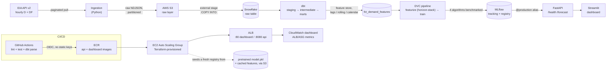

# GridCast ⚡

**An end-to-end MLOps platform for short-term electricity grid demand forecasting.**

GridCast ingests hourly load data from U.S. grid operators, warehouses and
transforms it through dbt on Snowflake, trains and benchmarks gradient-boosted
demand forecasters, serves the winning model through an API, and surfaces
predictions in a Streamlit dashboard — deployed to AWS behind a CI/CD pipeline
with zero long-lived cloud credentials.

It is built as a portfolio piece demonstrating a complete **data-engineering +
MLOps** workflow: ingestion → object storage → warehouse → transformation →
feature engineering → model selection → serving → deployment → CI/CD.

---

## Table of contents

- [What it does](#what-it-does)
- [Why this project](#why-this-project)
- [Architecture](#architecture)
- [Tech stack](#tech-stack)
- [Data source](#data-source)
- [The forecasting model](#the-forecasting-model)
- [MLOps: tracking, registry, and deploying without retraining](#mlops-tracking-registry-and-deploying-without-retraining)
- [Repository structure](#repository-structure)
- [Prerequisites](#prerequisites)
- [Quickstart](#quickstart)
- [Configuration](#configuration)
- [Pipeline stages in detail](#pipeline-stages-in-detail)
- [Deploying to AWS](#deploying-to-aws)
- [Build status](#build-status)
- [Design decisions](#design-decisions)
- [Limitations](#limitations)
- [Skills demonstrated](#skills-demonstrated)
- [License](#license)

---

## What it does

A user picks a **grid region** (PJM, CISO, or ERCOT) and the dashboard shows a
**next-24h hourly demand forecast curve**, pulled live from the API.

Two surfaces are exposed:

| Surface | Local URL | Role |
| --- | --- | --- |
| **Streamlit dashboard** | `http://localhost:8501` | Region picker → forecast chart + table |
| **FastAPI service** | `http://localhost:8000/docs` | `/health`, `/forecast?respondent=<region>`, OpenAPI docs |

Both are also deployed to AWS behind an Application Load Balancer — see
[Deploying to AWS](#deploying-to-aws).

---

## Why this project

Short-term load forecasting is a real, consequential problem: grid operators use
it to schedule generation and avoid both blackouts and wasteful over-provisioning.
It also happens to be an ideal backbone for showing off a *full* data platform,
because it touches every layer — time-series ingestion, warehousing, feature
engineering, model selection, serving, and cloud deployment.

The goal is a system that runs **end-to-end** and is **explainable layer by
layer**, with particular care given to the data-engineering core (dbt,
Snowflake) and to being honest about what's deployed versus what's still a
known gap — see [Limitations](#limitations).

---

## Architecture


```mermaid
flowchart LR
    EIA["EIA API v2<br/>hourly D + DF"] -->|paginated pull| ING["Ingestion<br/>(Python)"]
    ING -->|raw NDJSON,<br/>partitioned| S3["AWS S3<br/>raw layer"]
    S3 -->|external stage<br/>COPY INTO| SF[("Snowflake<br/>raw table")]
    SF --> DBT["dbt<br/>staging → intermediate → marts"]
    DBT -->|feature store,<br/>lags / rolling / calendar| FEAT[("fct_demand_features")]
    FEAT --> DVC["DVC pipeline<br/>featurize (horizon-stack) → train"]
    DVC -->|4 algorithms benchmarked| MLF[("MLflow<br/>tracking + registry")]
    MLF -->|"@production alias"| API["FastAPI<br/>/health /forecast"]
    API --> UI["Streamlit<br/>dashboard"]

    subgraph CD["CI/CD"]
        GH["GitHub Actions<br/>lint + test + dbt parse"] -->|OIDC, no static keys| ECR["ECR<br/>api + dashboard images"]
    end
    ECR --> ASG["EC2 Auto Scaling Group<br/>Terraform-provisioned"]
    ASG --> ALB["ALB<br/>:80 dashboard / :8080 api"]
    ASG -.seeds a fresh registry from.-> PKL[("pretrained model.pkl<br/>+ cached features, via S3")]
    ALB --> CW["CloudWatch dashboard<br/>ALB/ASG metrics"]
```

**Data flows in one direction**: external API → immutable object storage →
warehouse → transformed feature marts → model → serving → UI. Deployment is a
separate concern layered on top: GitHub Actions builds and pushes images on
every push to `main`; Terraform provisions the AWS runtime; and because the
production MLflow registry is deliberately ephemeral (see
[Design decisions](#design-decisions)), a small script re-imports the
already-trained model into whatever fresh registry a replacement instance
boots with, rather than retraining on every deploy.

---

## Tech stack

| Layer | Technology | Role in GridCast |
| --- | --- | --- |
| **Data source** | EIA Open Data API v2 | Hourly demand (`D`) and EIA's own day-ahead forecast (`DF`, used as a baseline) |
| **Ingestion** | Python (`requests`, `boto3`) | Paginated pull, retry/backoff, immutable raw landing |
| **Object storage** | AWS S3 | Raw, partitioned, immutable NDJSON landing zone |
| **Warehouse** | Snowflake | External stage + `COPY INTO`; raw + transformed schemas |
| **Transformation** | dbt | `staging → intermediate → marts` — the marts layer *is* the feature store |
| **Pipeline orchestration (data → model)** | DVC | `ingest → clean → featurize → train`, notebook-backed stages, hyperparameters in `params.yaml` |
| **Modeling** | LightGBM (winner), benchmarked against XGBoost / CatBoost / RandomForest | Gradient-boosted hourly demand forecaster |
| **Experiment tracking + registry** | MLflow | Run/metric logging, model registry, **alias-based** promotion (`@production`) |
| **Serving** | FastAPI | `/forecast?respondent=<region>` (24h curve), `/health` |
| **UI** | Streamlit | Region picker, forecast chart + table |
| **Packaging** | Docker + Docker Compose | 3-service stack: `mlflow`, `api`, `dashboard` |
| **CI/CD** | GitHub Actions | Lint, tests, `dbt parse`, then build+push to ECR — gated, OIDC-authenticated, no static AWS keys |
| **Infrastructure as Code** | Terraform | ECR, GitHub OIDC/IAM, VPC networking, ALB, EC2 Auto Scaling Group, CloudWatch dashboard |
| **Cloud runtime** | AWS (`ap-south-1`) | ALB → ASG (EC2) running the same 3-container stack, model + feature snapshot seeded from S3 |

---

## Data source

All data comes from the [EIA Open Data API v2](https://www.eia.gov/opendata/),
which is **free** — register at
[eia.gov/opendata/register.php](https://www.eia.gov/opendata/register.php) and a
key is emailed instantly.

- **Endpoint:** `https://api.eia.gov/v2/electricity/rto/region-data/data/`
- **Frequency:** `hourly` (UTC)
- **Regions (`respondent` facet):** `PJM`, `CISO`, `ERCO` (ERCOT)
- **Series (`type` facet):**
  - `D` — actual demand (the modeling target)
  - `DF` — EIA's day-ahead demand forecast (the **benchmark** the model is
    measured against)
- **Units:** megawatthours
- **Volume:** ~5 years backfilled per region — **131,402 raw hourly rows**
  across all three regions, expanding to **3.1M+ rows** once horizon-stacked
  for training (see below).
- **Pagination:** `offset` + `length` (max 5000 rows/request); the ingestion
  loop reads `response.total` and advances until the window is fully covered.

---

## The forecasting model

- **Target:** demand 1–24 hours ahead, per region — one row per
  `(respondent, origin hour, horizon)`.
- **Features (13, engineered in dbt, not Python):** hour-of-day, day-of-week,
  month, weekend/holiday flags, plus demand lag at *t−1h / t−24h / t−168h* and
  rolling mean/std over 24h and 168h windows (windows deliberately exclude the
  current row, and lags/rolling stats are computed *before* any implausible
  readings are filtered out — see `problem_faced.txt` entry 5 for why order
  matters there).
- **Model selection:** four algorithms were trained and compared behind one
  shared interface — **LightGBM won**, with **4.62% MAPE** vs. the EIA's own
  forecast baseline (**4.83% MAPE**), and trained in **~15 seconds** vs.
  RandomForest's ~25 minutes for a worse result.
- **Train/test split:** strictly **time-based** (never shuffled), with a
  **24-hour embargo gap** after the split point — without it, a horizon-24
  training row's target can land inside the test window.
- **Evaluation:** every candidate is scored against the *exact same* held-out
  rows as the EIA's own `DF` forecast, so "beats the baseline" is a
  same-rows, apples-to-apples claim, not an abstract error number.

---

## MLOps: tracking, registry, and deploying without retraining

- **Tracking:** every training run logs params, metrics (MAE/MAPE vs.
  baseline), and the model artifact to MLflow.
- **Registry, by alias not stage:** MLflow deprecated stage-based promotion
  (`None`/`Staging`/`Production`) in favor of aliases. The API resolves
  `models:/gridcast-demand-forecaster-lightgbm@production` — re-pointing that
  alias promotes a new version without changing any serving code.
- **Deploying an already-trained model, deliberately, without retraining:**
  the production MLflow instance's backing store is local SQLite on the EC2
  instance itself — ephemeral by design (see
  [Design decisions](#design-decisions)), so a replaced instance boots with an
  *empty* registry. `src/api/register_pretrained_model.py` re-imports the
  already-fitted model (pulled from S3, seeded at boot) into whatever fresh
  registry it finds and promotes it straight to `@production` — the same
  mechanism a "fresh deploy, no new training data" situation calls for, not
  just a workaround.
- **Not yet built:** drift detection and trigger-on-drift retraining.
  `requirements/monitoring.txt` pins `evidently`, but nothing consumes it yet.
  `src/api/main.py` logs a structured line per `/forecast` request
  (respondent, origin hour, latency) as a first step toward scoring
  predictions against ground truth later.

---

## Repository structure

```
gridcast/
├── README.md
├── docker-compose.yml           # local dev: mlflow, api, dashboard
├── docker/
│   ├── api.Dockerfile
│   └── dashboard.Dockerfile
├── Makefile                     # install / ingest / dbt-build / api / dashboard / tf-*
├── dvc.yaml                     # ingest → clean → featurize → train
├── params.yaml                  # per-algorithm hyperparameters
├── .env.example
├── .github/workflows/ci.yml     # lint+test, dbt parse, build+push (OIDC → ECR)
├── config/
│   └── data_ingestion.config    # regions, series types, retry/backoff
├── snowflake/
│   ├── setup.sql                # external stage + COPY INTO
│   └── ddl.sql
├── dbt/gridcast/models/
│   ├── staging/                 # 1:1 typed views over raw sources
│   ├── intermediate/            # pivot D/DF, filter implausible readings
│   └── marts/                   # fct_demand_features — the feature store
├── notebooks/                   # 01_ingest, 02_clean, 03_features, 04_train_<algo>
├── src/
│   ├── ingestion/                # EIA client: pagination, retry, NDJSON + manifest writer
│   ├── warehouse/snowflake_client.py
│   ├── ml/                       # dataset.py (horizon-stack, time split), model.py (4 algorithms)
│   ├── api/
│   │   ├── main.py                       # FastAPI: /health, /forecast
│   │   ├── refresh_feature_cache.py      # pulls latest row/respondent from Snowflake
│   │   └── register_pretrained_model.py  # imports an already-fitted model into MLflow
│   └── dashboard/app.py         # Streamlit UI
├── models/                      # trained .pkl artifacts (gitignored)
├── data/                        # raw/interim/processed/cache (gitignored)
├── requirements/                # base/dbt/dev/ml/monitoring/notebook/serve
├── terraform/
│   ├── providers.tf / variables.tf / outputs.tf
│   ├── ecr.tf / iam_oidc.tf                    # CI/CD track
│   ├── networking.tf / security_groups.tf
│   ├── iam_ec2.tf / compute.tf / alb.tf        # deploy track
│   ├── cloudwatch.tf                            # ALB/ASG dashboard
│   └── templates/user_data.sh.tpl               # boot script: pulls artifacts, registers model
├── airflow/dags/                # empty — deliberately last in the build sequence
└── problem_faced.txt            # running log of real bugs hit + how they were fixed
```

---

## Prerequisites

- **Docker** and **Docker Compose** (local dev)
- **Python 3.11+**
- A free **EIA API key**
- An **AWS account** (S3 for raw landing; optional — see
  [Deploying to AWS](#deploying-to-aws) for the full cloud runtime)
- A **Snowflake account**

---

## Quickstart

```bash
# 1. Clone and configure
git clone https://github.com/deva3004/gridcast.git
cd gridcast
cp .env.example .env          # fill in EIA_API_KEY, S3 bucket, Snowflake creds

# 2. Land data (inspect locally first, no AWS needed)
make install
python -m src.ingestion.run --dry-run     # writes NDJSON + manifests under ./data/

# 2b. Real backfill to S3 (~5 years, all regions/types, per config/data_ingestion.config)
python -m src.ingestion.run

# 3. Warehouse setup + transformations
#    run snowflake/setup.sql once, then:
make dbt-build

# 4. Train (runs the DVC pipeline: ingest → clean → featurize → train)
dvc repro

# 5. Bring up the full local stack
docker compose up --build
#    → dashboard at http://localhost:8501
#    → API docs  at http://localhost:8000/docs
```

---

## Configuration

All secrets and connection settings come from environment variables (see
`.env.example`):

| Variable | Purpose |
| --- | --- |
| `EIA_API_KEY` | EIA Open Data API key |
| `GRIDCAST_S3_BUCKET` / `AWS_REGION` | Target bucket + region for raw landing |
| `AWS_ACCESS_KEY_ID` / `AWS_SECRET_ACCESS_KEY` | AWS credentials (prefer the standard `aws configure` chain) |
| `SNOWFLAKE_ACCOUNT` / `_USER` / `_PASSWORD` / `_ROLE` / `_WAREHOUSE` / `_DATABASE` / `_SCHEMA` | Warehouse connection |
| `MLFLOW_TRACKING_URI` | MLflow server location |
| `GRIDCAST_API_URL` | API location the dashboard calls |

Credentials are **never** committed; `.env` is gitignored and `.env.example`
documents the contract. In production, the Snowflake block is stored as a
single SSM `SecureString` parameter, created out-of-band (not by Terraform —
see [Design decisions](#design-decisions)).

---

## Pipeline stages in detail

1. **Ingest** — `src/ingestion/ingest_eia.py` paginates `D` and `DF` for each
   region and writes immutable NDJSON to S3, partitioned as
   `region=<R>/type=<T>/ingest_date=<date>/`, plus a run manifest for lineage.
2. **Stage** — a Snowflake external stage + `COPY INTO` loads the raw NDJSON
   into a `VARIANT` raw table.
3. **Transform (dbt)** — `staging` types the raw records; `intermediate`
   pivots `D`/`DF` into wide columns and nulls out physically implausible
   readings (*before* any window function sees them); `marts` builds
   `fct_demand_features` — lags, rolling stats, calendar flags, one row per
   respondent-hour.
4. **Featurize + train (DVC)** — `stack_horizons` turns the feature mart into
   one row per `(respondent, origin hour, horizon 1–24)`; `time_split` splits
   by origin hour with a 24h embargo; `model.py` fits whichever algorithm
   `params.yaml` names and logs metrics + the model artifact to MLflow.
5. **Serve** — FastAPI resolves the registered model by alias and exposes
   `/forecast` and `/health`.
6. **Visualize** — Streamlit calls the API and renders the region's forecast.
7. **Deploy** — GitHub Actions builds and pushes images on every push to
   `main`; Terraform-provisioned infrastructure runs them on AWS. See below.

---

## Deploying to AWS

```bash
make tf-init    # first time only
make tf-plan    # review what Terraform will create/change
make tf-apply   # provision ECR, GitHub OIDC role, VPC networking, ALB, ASG, CloudWatch dashboard
```

CI/CD authenticates to AWS via **GitHub's OIDC provider** — the IAM role's
trust policy is scoped to `repo:<owner>/gridcast:ref:refs/heads/main` only, so
no long-lived AWS access keys ever sit in GitHub. Once applied, the ALB's DNS
name (`terraform output alb_dns_name`) serves the dashboard on `:80` and the
API on `:8080`.

Because the runtime EC2 instance's MLflow registry is ephemeral (see below),
a fresh instance needs the already-trained model and a feature snapshot
seeded from S3 (`s3://<bucket>/deploy-artifacts/`) rather than a live
Snowflake pull — useful both for normal deploys and for the specific case of
redeploying while the source warehouse is unreachable.

A CloudWatch dashboard (`terraform/cloudwatch.tf`) surfaces ALB request
count, latency, 5XX errors, and target health — metrics CloudWatch already
emits for free, visualized with no extra agents.


---

## Design decisions

- **Time-based split with an embargo, never shuffled** — prevents leakage of
  future demand into training, and specifically prevents a horizon-24 row's
  target hour from landing inside the test window.
- **Benchmark against EIA's `DF`** — measures the model against the grid
  operator's own published forecast on identical rows, not an arbitrary
  baseline.
- **dbt marts *are* the feature store** — a single SQL-computed source of
  truth for point-in-time-correct features, consumed by training and (via a
  cached snapshot) serving, rather than two implementations that can drift
  apart (see `problem_faced.txt` entry 3).
- **MLflow aliases, not stages** — matches what current MLflow registry UIs
  actually support, and lets promotion happen without touching serving code.
- **ASG `health_check_type = "EC2"`, not `"ELB"`** — the registry's SQLite
  backend lives on the instance itself with no durable store behind it. An
  ELB-type check reacting to a transient app hiccup would replace the
  instance — and wipe the registry — far more often than an actual instance
  failure would.
- **Two ALB listeners instead of path-based routing** — `main.py`'s routes
  are `/health`/`/forecast` at the root; a second listener on a different
  port costs nothing and avoids rewriting application routes to satisfy a
  load balancer.
- **SSM parameter created out-of-band, not by Terraform** — an
  `aws_ssm_parameter` resource's value round-trips through Terraform state in
  plaintext even as a `SecureString`. Terraform provisions IAM read access to
  the parameter; the value itself never enters git or state.
- **Keyless CI/CD (GitHub OIDC)** — no long-lived AWS credentials stored in
  GitHub, scoped to pushes on `main` only.

---

## Limitations

- **MLflow's registry is ephemeral per instance.** A replaced EC2 instance
  boots with an empty registry — mitigated by re-importing the already-trained
  model on boot, not by durable storage (no RDS/EFS behind it yet).
- **Feature cache can go stale.** `/forecast` serves from a cached snapshot,
  refreshed hourly by cron; if the Snowflake warehouse is unreachable, the
  snapshot simply doesn't advance rather than the API failing.
- **Single instance, no HA.** The ASG allows up to 2 instances but normally
  runs 1 — no zero-downtime multi-AZ failover today.
- **No drift monitoring yet.** `evidently` is a pinned dependency, not a
  running system.
- **Local Terraform state.** No remote backend or state locking — fine for a
  single operator, not for a team.
- **HTTP only.** No custom domain or TLS is provisioned for the ALB.

---

## Skills demonstrated

**Data engineering:** API ingestion with pagination/retry/backoff, immutable
partitioned data-lake design (S3), Snowflake external stages + `COPY INTO`,
dbt modeling layers with point-in-time-correct SQL feature engineering.

**MLOps:** time-series modeling without leakage (embargoed time split),
multi-algorithm benchmarking against a real operational baseline, MLflow
experiment tracking and alias-based model registry, deploying an
already-trained model into a fresh registry without retraining.

**Platform / delivery:** FastAPI + Streamlit, Docker Compose multi-service
packaging, GitHub Actions CI/CD with keyless OIDC authentication, Terraform
IaC (ECR, IAM, VPC, ALB, ASG, CloudWatch), least-privilege IAM iterated
against real permission gaps (see `problem_faced.txt`).

---

## License

MIT — see `LICENSE`.

*Data courtesy of the U.S. Energy Information Administration (EIA), used under
the terms of the EIA Open Data API.*
